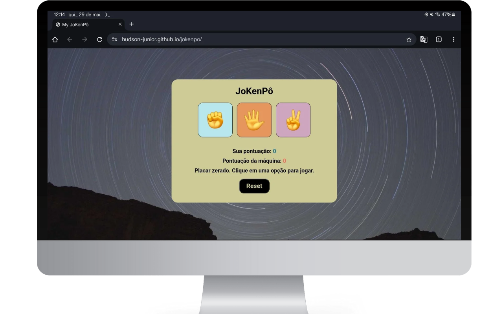
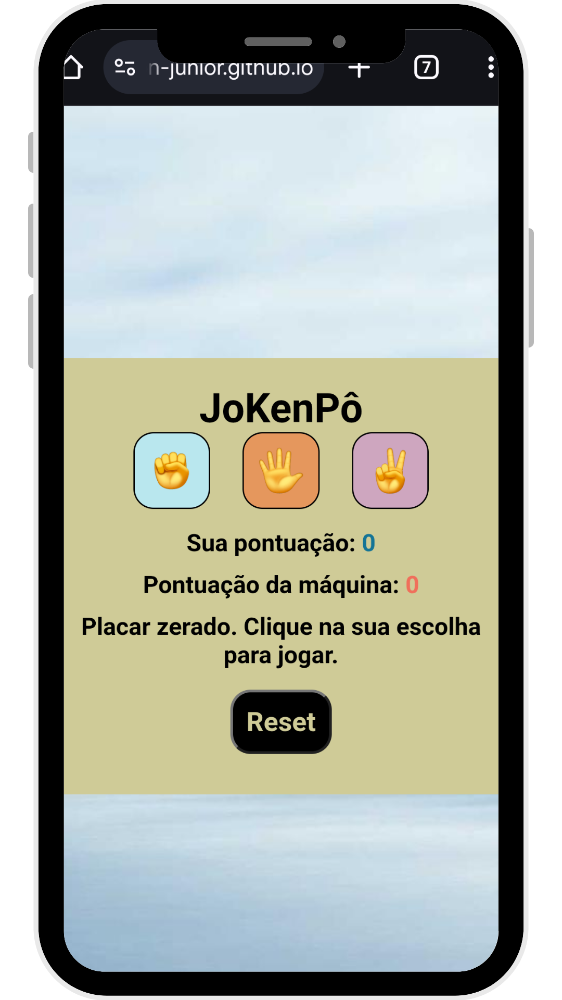

# ✊🖐️✌️ Jogo JoKenPô / Rock Paper Scissors Game

Projeto interativo de JoKenPô (Pedra, Papel e Tesoura), onde o jogador desafia a máquina. O jogo exibe o placar em tempo real, mostra as jogadas e permite resetar os pontos. Uma ótima prática de lógica condicional, DOM e interatividade com JavaScript.

Interactive Rock-Paper-Scissors game where the player challenges the machine. The game shows real-time scores, displays each move, and allows resetting the scoreboard. A great exercise in conditional logic, DOM manipulation, and user interaction using JavaScript.

---

## 🚀 Tecnologias Utilizadas / Technologies Used

- **HTML5** – Estrutura da página / Page structure  
- **CSS3** – Estilização e layout / Styling and layout  
- **JavaScript (Vanilla)** – Lógica do jogo e interação / Game logic and interaction

---

## ✨ Funcionalidades / Features

- O jogador escolhe entre pedra 🪨, papel 📄 ou tesoura ✂️  
  The player chooses between rock 🪨, paper 📄 or scissors ✂️

- A máquina faz uma escolha aleatória  
  The machine randomly selects an option

- Exibição do resultado da rodada: vitória, derrota ou empate  
  Displays round result: win, loss, or draw

- Placar atualizado em tempo real na tela  
  Live scoreboard update on screen

- Mensagem com o que cada jogador escolheu  
  Shows the choices of player and machine

- Botão para resetar o placar  
  Reset button to clear the score

- Estilo visual com cores, sombras e animações suaves  
  Visual styling with colors, shadows and smooth transitions

---

## 📷 Preview do projeto / Project Preview

  
  

---

## ✅ Projeto finalizado

## 🧑‍💻 Desenvolvido por

Hudson Júnior  
 • 
